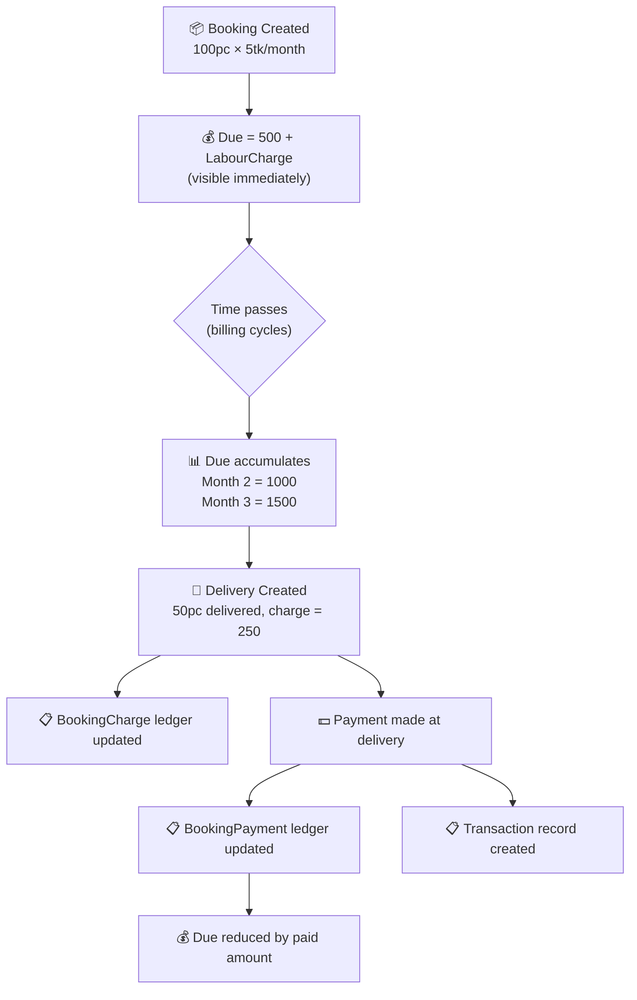

# Fix Customer Due Calculation — Business-Aligned Accrual Model

## Business Requirement (from Client)

> **Booking 100pc × 5tk → Customer Due = 500 + labour charge (immediately)**
> **After delivery & payment → update ledger**

### Expected Business Flow



---

## User Review Required

> [!IMPORTANT]
> I found **a critical off-by-one bug** in `BookingDueCalculator` — after the first complete billing cycle elapses, the initial charge is **replaced** by the recurring amount instead of being **added** to it. This means Month 2 shows ₹500 instead of ₹1000.

> [!WARNING]
> There are **two different versions** of `GetInitialBookingAccruedAmount` in the codebase — one includes `LabourCharge`, the other doesn't. This causes inconsistent dues across different screens.

---

## Root Cause Analysis

### Bug 1: Off-by-one in accrual formula (CRITICAL)

**File**: [BookingDueCalculator.cs:L25-L28](file:///d:/Personel/FrostTrack_Web/Application/Services/Common/BookingDueCalculator.cs#L25-L28)

Current code (no deliveries, after 1+ complete cycles):
```csharp
var computed = PendingRecurringChargeAmount(activeDetails, booking.BookingDate, asOfDate);
var initialAccrued = GetInitialBookingAccruedAmount(booking);
var pendingRecurringCharge = computed > 0 ? computed : initialAccrued;
// ❌ BUG: When computed > 0, initialAccrued is DISCARDED
```

**What happens today (Booking 100pc × 5tk Monthly)**:

| Time | `CompletedCycles` | `computed` | `initialAccrued` | **Result (current)** | **Expected** |
|------|-------------------|-----------|--------------------|----------------------|-------------|
| Day 1 (same day) | 0 | 0 | 500 | **500** ✅ | 500 |
| Month 2 | 1 | 500 | 500 | **500** ❌ | **1000** |
| Month 3 | 2 | 1000 | 500 | **1000** ❌ | **1500** |
| Month 6 | 5 | 2500 | 500 | **2500** ❌ | **3000** |

The formula `computed > 0 ? computed : initialAccrued` is a **ternary replacement** — it should be an **addition**: `initialAccrued + computed`.

**Same bug exists in 3 locations**:
1. [BookingDueCalculator.cs:L27](file:///d:/Personel/FrostTrack_Web/Application/Services/Common/BookingDueCalculator.cs#L27)
2. [BookingService.cs:L767](file:///d:/Personel/FrostTrack_Web/Application/Services/BookingService.cs#L767) (CustomerDueDetail)
3. [BookingService.cs:L900](file:///d:/Personel/FrostTrack_Web/Application/Services/BookingService.cs#L900) (CustomerOutstanding)

---

### Bug 2: `GetInitialBookingAccruedAmount` — two inconsistent versions

**Version A** in [BookingDueCalculator.cs:L32-L37](file:///d:/Personel/FrostTrack_Web/Application/Services/Common/BookingDueCalculator.cs#L32-L37):
```csharp
// ❌ Missing LabourCharge
.Sum(d => (decimal)d.BookingQuantity * d.BookingRate)
```

**Version B** in [BookingService.cs:L934-L937](file:///d:/Personel/FrostTrack_Web/Application/Services/BookingService.cs#L934-L937):
```csharp
// ✅ Includes LabourCharge
.Sum(bd => ((decimal)bd.BookingQuantity * bd.BookingRate) + bd.LabourCharge)
```

The client requires: **Due = 500 + labour charge**. Version A (used by `BillCollectionService`) is wrong — it excludes labour.

---

### Bug 3: `BillCollectionService.GetBookingPaidAmountAsync` excludes LABOUR_CHARGE payments

**File**: [BillCollectionService.cs:L159-L165](file:///d:/Personel/FrostTrack_Web/Application/Services/BillCollectionService.cs#L159-L165)

```csharp
// ❌ Only counts BILL_COLLECTION — ignores LABOUR_CHARGE payments
.Where(t => t.TransactionHead!.UsageFor == UsageFor.BILL_COLLECTION
            && t.TransactionHead!.Type == TransactionHeadTypes.CREDIT)
```

When a delivery is paid with labour charge, the system creates **two transactions**: one BILL_COLLECTION and one LABOUR_CHARGE. But this method only sums the BILL_COLLECTION portion, so the "paid" amount is understated.

---

### Bug 4: `STORAGE_CHARGE` transaction head is `DEBIT` type

**File**: [TransactionHeadConfiguration.cs:L106](file:///d:/Personel/FrostTrack_Web/Persistence/Configurations/TransactionHeadConfiguration.cs#L106)

```csharp
Type = TransactionHeadTypes.DEBIT, // ← marks booking charge as EXPENSE
```

When a booking creates a `STORAGE_CHARGE` transaction, it's categorized as a **DEBIT (expense)**. But this isn't an expense — it's an **accounts receivable** (the customer owes you). In the Dashboard, DEBIT transactions are summed under "Total Expense", which inflates expenses and deflates net revenue.

---

## Proposed Changes

### Phase 1: Fix Accrual Formula (Core Business Fix)

#### [MODIFY] [BookingDueCalculator.cs](file:///d:/Personel/FrostTrack_Web/Application/Services/Common/BookingDueCalculator.cs)

Fix the formula to **always include the initial cycle** and **include labour charge**:

```diff
 public static (decimal TotalAccrued, decimal PendingRecurringCharge) CalculateBookingAccruedAmount(
     Booking booking,
     IEnumerable<BookingDetail> activeDetails,
     decimal totalDeliveryCharge,
     DateTime asOfDate)
 {
     if (totalDeliveryCharge > 0)
     {
         var lastDeliveryDate = activeDetails.Any()
             ? activeDetails.Max(d => (DateTime?)d.LastDeliveryDate) ?? booking.BookingDate
             : booking.BookingDate;
             
         var pendingRecurringCharge = RecurringChargeCalculator.PendingRecurringChargeAmount(activeDetails, lastDeliveryDate, asOfDate);
         return (totalDeliveryCharge + pendingRecurringCharge, pendingRecurringCharge);
     }
     else
     {
-        var computed = RecurringChargeCalculator.PendingRecurringChargeAmount(activeDetails, booking.BookingDate, asOfDate);
         var initialAccrued = GetInitialBookingAccruedAmount(booking);
-        var pendingRecurringCharge = computed > 0 ? computed : initialAccrued;
-        return (pendingRecurringCharge, pendingRecurringCharge);
+        var recurringCharge = RecurringChargeCalculator.PendingRecurringChargeAmount(activeDetails, booking.BookingDate, asOfDate);
+        var totalAccrued = initialAccrued + recurringCharge;
+        return (totalAccrued, recurringCharge);
     }
 }

 private static decimal GetInitialBookingAccruedAmount(Booking booking)
 {
     return booking.BookingDetails?
         .Where(d => !d.IsDeleted)
-        .Sum(d => (decimal)d.BookingQuantity * d.BookingRate) ?? 0m;
+        .Sum(d => (decimal)d.BookingQuantity * d.BookingRate + d.LabourCharge) ?? 0m;
 }
```

**After fix**:

| Time | `initialAccrued` | `recurringCharge` | **Total Due** |
|------|-----------------|-------------------|--------------|
| Day 1 | 500 + labour | 0 | **500 + labour** ✅ |
| Month 2 | 500 + labour | 500 | **1000 + labour** ✅ |
| Month 3 | 500 + labour | 1000 | **1500 + labour** ✅ |

---

#### [MODIFY] [BookingService.cs](file:///d:/Personel/FrostTrack_Web/Application/Services/BookingService.cs)

Fix the **same formula** in the 2 local copies (CustomerDueDetail L767 and CustomerOutstanding L900):

```diff
 // Line 767 (CustomerDueDetail)
-pendingRecurringCharge = computed > 0 ? computed : GetInitialBookingAccruedAmount(booking);
+pendingRecurringCharge = GetInitialBookingAccruedAmount(booking) + computed;

 // Line 900 (CustomerOutstanding)
-accrued = computed > 0 ? computed : GetInitialBookingAccruedAmount(booking);
+accrued = GetInitialBookingAccruedAmount(booking) + computed;
```

> [!NOTE]
> `BookingService` already has the correct version of `GetInitialBookingAccruedAmount` (includes LabourCharge at L936). No change needed there.

---

### Phase 2: Unify Paid-Amount Calculation

#### [MODIFY] [BillCollectionService.cs](file:///d:/Personel/FrostTrack_Web/Application/Services/BillCollectionService.cs)

Fix `GetBookingPaidAmountAsync` to include **both** BILL_COLLECTION and LABOUR_CHARGE, and use `NetAmount`:

```diff
 public async Task<decimal> GetBookingPaidAmountAsync(Guid bookingId, CancellationToken ct)
 {
     var paidAmount = await _transactionRepository.Query()
-        .Where(t => t.BookingId == bookingId &&
-                   t.TransactionHead!.UsageFor == UsageFor.BILL_COLLECTION &&
-                   t.TransactionHead!.Type == TransactionHeadTypes.CREDIT)
-        .SumAsync(t => t.Amount, ct);
+        .Where(t => t.BookingId == bookingId &&
+                   !t.IsDeleted &&
+                   t.TransactionHead!.Type == TransactionHeadTypes.CREDIT &&
+                   (t.TransactionHead!.UsageFor == UsageFor.BILL_COLLECTION ||
+                    t.TransactionHead!.UsageFor == UsageFor.LABOUR_CHARGE))
+        .SumAsync(t => t.NetAmount, ct);
     return paidAmount;
 }
```

Fix `GetBookingsWithDueAsync` paid-amount query similarly:

```diff
 // Line 61-67 — paid amounts map
 var paidAmountsMap = await _transactionRepository.Query()
     .Where(t => t.BookingId != null && bookingIds.Contains(t.BookingId.Value) &&
-                   t.TransactionHead!.UsageFor == UsageFor.BILL_COLLECTION &&
-                   t.TransactionHead!.Type == TransactionHeadTypes.CREDIT)
+                   !t.IsDeleted &&
+                   t.TransactionHead!.Type == TransactionHeadTypes.CREDIT &&
+                   (t.TransactionHead!.UsageFor == UsageFor.BILL_COLLECTION ||
+                    t.TransactionHead!.UsageFor == UsageFor.LABOUR_CHARGE))
     .GroupBy(t => t.BookingId!.Value)
-    .Select(g => new { BookingId = g.Key, PaidAmount = g.Sum(t => t.Amount) })
+    .Select(g => new { BookingId = g.Key, PaidAmount = g.Sum(t => t.NetAmount) })
     .ToDictionaryAsync(x => x.BookingId, x => x.PaidAmount, ct);
```

---

### Phase 3: Fix STORAGE_CHARGE Accounting Direction

#### [MODIFY] [TransactionHeadConfiguration.cs](file:///d:/Personel/FrostTrack_Web/Persistence/Configurations/TransactionHeadConfiguration.cs)

```diff
 new TransactionHead
 {
     Code = "STORAGE_CHARGE",
     Name = "Storage Charge",
-    Type = TransactionHeadTypes.DEBIT,
+    Type = TransactionHeadTypes.CREDIT,
-    DisplayType = "RECEIVABLE",
+    DisplayType = "RECEIVABLE",
     UsageFor = UsageFor.BOOKING,
 }
```

> [!WARNING]
> This changes seed data only. If this transaction head already exists in production DB, you'll need a **data migration** to update the `Type` from `DEBIT` to `CREDIT`. Otherwise the seed won't re-run for existing tenants. Do you want me to include a migration script?

---

### Phase 4: Ensure Delivery Ledger Integrity

#### [MODIFY] [ProductDeliveryService.cs](file:///d:/Personel/FrostTrack_Web/Application/Services/ProductDeliveryService.cs)

**4a. `UpdateAsync` — recreate `BookingCharge` entries**:
After clearing and recreating delivery details (line ~322-345), also:
1. Delete old `BookingCharge` records for this delivery
2. Create new `BookingCharge` records matching the new details

**4b. `DeleteAsync` — cascade to ledger tables**:
```diff
 public async Task<bool> DeleteAsync(Guid id)
 {
+    // Clean up ledger entries
+    await _bookingChargeRepository.DeletableQuery(x => x.DeliveryId == id).ExecuteDeleteAsync();
+    await _bookingPaymentRepository.DeletableQuery(x => x.DeliveryId == id).ExecuteDeleteAsync();
     var result = await _repository.DeletableQuery(x => x.Id == id).ExecuteDeleteAsync();
     var result1 = await _transactionRepository.DeletableQuery(x => x.DeliveryId == id).ExecuteDeleteAsync();
     return result > 0;
 }
```

**4c. `SoftDeleteAsync` — also soft-delete linked transactions**:
```diff
 public async Task<bool> SoftDeleteAsync(Guid id, CancellationToken ct)
 {
     var entity = await _repository.Query().FirstOrDefaultAsync(x => x.Id == id, ct);
     if (entity == null) throw new Exception("Product delivery not found");
     entity.IsDeleted = true;
     entity.DeletedAt = DateTime.UtcNow;
     entity.DeletedById = _currentUser.Id;
     await _repository.UpdateAsync(entity, ct);
+
+    // Also soft-delete linked transactions to prevent ghost revenue
+    if (entity.TransactionId.HasValue)
+    {
+        var linkedTransactions = await _transactionRepository.UpdatableQuery(
+            t => t.DeliveryId == id && !t.IsDeleted).ToListAsync(ct);
+        foreach (var txn in linkedTransactions)
+        {
+            txn.IsDeleted = true;
+            txn.DeletedAt = DateTime.UtcNow;
+            txn.DeletedById = _currentUser.Id;
+            await _transactionRepository.UpdateAsync(txn, ct);
+        }
+    }
     return true;
 }
```

---

## Open Questions

1. **STORAGE_CHARGE transaction head** — The current seed marks it as `DEBIT`. If production DB already has this, should I generate a migration script to update it to `CREDIT`? Or does the client not want booking charges to appear as accounting transactions at all?

2. **Multiple billing types** — The fix assumes all booking details within a booking can have different `BillType` (Monthly, Daily, etc.). The booking creation currently hardcodes `BillType = Monthly` (line 80). Is this intentional, or should the frontend send the billing type?

---

## Verification Plan

### Automated Tests
```bash
dotnet build FrostTrack.sln --configuration Release
dotnet test TestServer/
```

### Manual Verification
- Create a booking: 100pc × 5tk → verify Customer Due = 500 + labour charge
- Wait (or simulate) 1 month → verify Due = 1000 + labour
- Create delivery 50pc → verify BookingCharge ledger entry created
- Pay delivery → verify BookingPayment created and Due reduced correctly
- Soft-delete delivery → verify linked transactions also soft-deleted
- Check Dashboard → verify STORAGE_CHARGE not counted as expense
