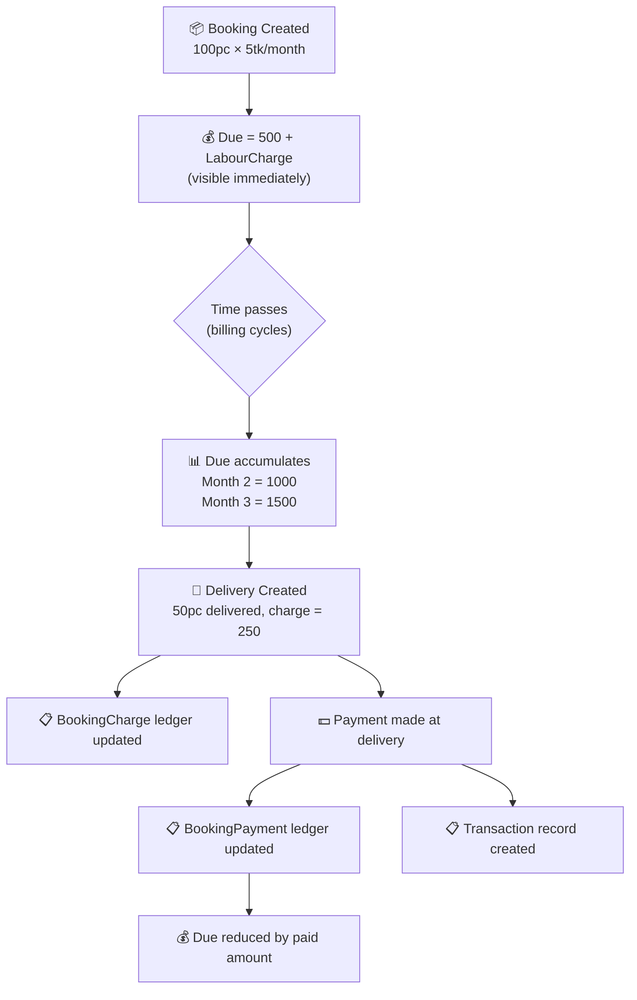

# FrostTrack Web — Unified Audit & Remediation Plan

Comprehensive 14-role committee audit merged with business-aligned customer due fixes. **23 findings** organized into **5 prioritized phases**.

---

## Business Requirement (from Client)

> **Booking 100pc × 5tk → Customer Due = 500 + labour charge (immediately)**
> **After delivery & payment → update ledger**



---

## User Review Required

> [!IMPORTANT]
> **Critical off-by-one bug found**: After the first complete billing cycle, the initial charge is **replaced** instead of **accumulated**. Month 2 shows 500 instead of 1000.

> [!WARNING]
> **Two different versions** of `GetInitialBookingAccruedAmount` exist — one includes `LabourCharge`, the other doesn't. Customer dues differ across screens.

> [!WARNING]
> Several findings affect **financial data integrity** (customer dues, delivery billing, transaction double-counting, ghost revenue from soft-deleted deliveries). All Phase 1-2 items are **P0 critical**.

---

## Master Findings Table

| # | Severity | Finding | Phase |
|---|----------|---------|-------|
| 1 | 🔴 P0 | Off-by-one accrual bug — initial charge replaced instead of accumulated | 1 |
| 2 | 🔴 P0 | `BookingDueCalculator.GetInitialBookingAccruedAmount` excludes LabourCharge | 1 |
| 3 | 🔴 P0 | `BillCollectionService` uses `Amount` instead of `NetAmount` | 1 |
| 4 | 🔴 P0 | `BillCollectionService` excludes `LABOUR_CHARGE` from paid total | 1 |
| 5 | 🔴 P0 | Inconsistent paid-amount formulas between `BillCollectionService` and `BookingService` | 1 |
| 6 | 🔴 P0 | `STORAGE_CHARGE` transaction head is DEBIT (inflates expenses on dashboard) | 1 |
| 7 | 🔴 P0 | Delivery soft-delete leaves ghost transactions (inflates revenue) | 2 |
| 8 | 🔴 P0 | Delivery `UpdateAsync` doesn't refresh `BookingCharge` ledger | 2 |
| 9 | 🔴 P0 | Delivery `DeleteAsync` doesn't clean up `BookingCharge`/`BookingPayment` | 2 |
| 10 | 🟠 P1 | `Transaction.EmployeeId` duplicates `SalaryPayment.EmployeeId` | 5 |
| 11 | 🟠 P1 | `BookingPayment` vs `Transaction` — parallel payment ledgers (written, never read) | 5 |
| 12 | 🟠 P1 | `BookingCharge` vs `DeliveryDetail` — duplicate charge data (written, never read) | 5 |
| 13 | 🟠 P1 | `BookingCharge`/`BookingPayment` missing tenant query filters & indexes | 3 |
| 14 | 🟠 P1 | `RecurringChargeEntry` missing tenant query filter & index | 3 |
| 15 | 🟠 P1 | `Company` query filter missing `Guid.Empty` guard | 3 |
| 16 | 🟠 P1 | Missing explicit tenant filter in `BillCollectionService.GetBookingPaidAmountAsync` | 3 |
| 17 | 🟡 P2 | `ServiceCharge` entity — orphan with no DbSet | 4 |
| 18 | 🟡 P2 | `SalesType` — legacy POS artifact | 4 |
| 19 | 🟡 P2 | `ECustomerType` — POS terminology (Retail/Wholesale) | 4 |
| 20 | 🟡 P2 | `PrintSettings.ShowSupplierInfo` — legacy POS field | 4 |
| 21 | 🟡 P2 | Empty `ProductReceive` directory | 4 |
| 22 | 🟡 P2 | ~180 lines commented-out POS code in `ApplicationDbContext` | 4 |
| 23 | 🟡 P2 | `WeatherForecast` scaffolding remnants | 4 |
| 24 | 🟡 P2 | Duplicate `using System.ComponentModel` in Enums.cs | 4 |
| 25 | 🔵 P3 | `DELEVERY` typo in `UsageFor` constants | 4 |
| 26 | 🔵 P3 | Customer code gen returns `"S-"` instead of `"C-"` | 4 |

---

## Phase 1: Fix Customer Due Accrual & Payment Calculations (P0 Critical)

> Fixes findings 1–6. Directly addresses the client requirement.

---

### 1.1 Fix Off-by-One Accrual Bug + Include LabourCharge

#### [MODIFY] [BookingDueCalculator.cs](file:///d:/Personel/FrostTrack_Web/Application/Services/Common/BookingDueCalculator.cs)

**Bug**: `computed > 0 ? computed : initialAccrued` — replaces initial charge instead of accumulating.
**Bug**: `GetInitialBookingAccruedAmount` excludes `LabourCharge`.

**Current behavior** (Booking 100pc × 5tk Monthly):

| Time | CompletedCycles | computed | initialAccrued | **Result** | **Expected** |
|------|:-:|:-:|:-:|:-:|:-:|
| Day 1 | 0 | 0 | 500 | **500** ✅ | 500 |
| Month 2 | 1 | 500 | 500 | **500** ❌ | **1000** |
| Month 3 | 2 | 1000 | 500 | **1000** ❌ | **1500** |

```diff
 // No-delivery branch (line 23-29)
 else
 {
-    var computed = RecurringChargeCalculator.PendingRecurringChargeAmount(activeDetails, booking.BookingDate, asOfDate);
     var initialAccrued = GetInitialBookingAccruedAmount(booking);
-    var pendingRecurringCharge = computed > 0 ? computed : initialAccrued;
-    return (pendingRecurringCharge, pendingRecurringCharge);
+    var recurringCharge = RecurringChargeCalculator.PendingRecurringChargeAmount(activeDetails, booking.BookingDate, asOfDate);
+    var totalAccrued = initialAccrued + recurringCharge;
+    return (totalAccrued, recurringCharge);
 }

 // Fix GetInitialBookingAccruedAmount (line 32-37)
 private static decimal GetInitialBookingAccruedAmount(Booking booking)
 {
     return booking.BookingDetails?
         .Where(d => !d.IsDeleted)
-        .Sum(d => (decimal)d.BookingQuantity * d.BookingRate) ?? 0m;
+        .Sum(d => (decimal)d.BookingQuantity * d.BookingRate + d.LabourCharge) ?? 0m;
 }
```

**After fix**: Day 1 = 500+labour ✅ | Month 2 = 1000+labour ✅ | Month 3 = 1500+labour ✅

---

#### [MODIFY] [BookingService.cs](file:///d:/Personel/FrostTrack_Web/Application/Services/BookingService.cs)

Same off-by-one bug exists in 2 local copies. The local `GetInitialBookingAccruedAmount` (L934) already includes LabourCharge — only the formula needs fixing.

```diff
 // Line 767 (CustomerDueDetail — no deliveries branch)
-pendingRecurringCharge = computed > 0 ? computed : GetInitialBookingAccruedAmount(booking);
+pendingRecurringCharge = GetInitialBookingAccruedAmount(booking) + computed;

 // Line 900 (CustomerOutstanding — no deliveries branch)
-accrued = computed > 0 ? computed : GetInitialBookingAccruedAmount(booking);
+accrued = GetInitialBookingAccruedAmount(booking) + computed;
```

---

### 1.2 Unify Paid-Amount Calculation

#### [MODIFY] [BillCollectionService.cs](file:///d:/Personel/FrostTrack_Web/Application/Services/BillCollectionService.cs)

**Bug 1**: Uses `Amount` instead of `NetAmount` (ignores discounts).
**Bug 2**: Excludes `LABOUR_CHARGE` payments from paid total.
**Bug 3**: Missing `!t.IsDeleted` filter.

```diff
 // GetBookingPaidAmountAsync (line 159-165)
 var paidAmount = await _transactionRepository.Query()
-    .Where(t => t.BookingId == bookingId &&
-               t.TransactionHead!.UsageFor == UsageFor.BILL_COLLECTION &&
-               t.TransactionHead!.Type == TransactionHeadTypes.CREDIT)
-    .SumAsync(t => t.Amount, cancellationToken);
+    .Where(t => t.BookingId == bookingId &&
+               !t.IsDeleted &&
+               t.TransactionHead!.Type == TransactionHeadTypes.CREDIT &&
+               (t.TransactionHead!.UsageFor == UsageFor.BILL_COLLECTION ||
+                t.TransactionHead!.UsageFor == UsageFor.LABOUR_CHARGE))
+    .SumAsync(t => t.NetAmount, cancellationToken);

 // GetBookingsWithDueAsync paid amounts map (line 61-67)
 var paidAmountsMap = await _transactionRepository.Query()
     .Where(t => t.BookingId != null && bookingIds.Contains(t.BookingId.Value) &&
-               t.TransactionHead!.UsageFor == UsageFor.BILL_COLLECTION &&
-               t.TransactionHead!.Type == TransactionHeadTypes.CREDIT)
+               !t.IsDeleted &&
+               t.TransactionHead!.Type == TransactionHeadTypes.CREDIT &&
+               (t.TransactionHead!.UsageFor == UsageFor.BILL_COLLECTION ||
+                t.TransactionHead!.UsageFor == UsageFor.LABOUR_CHARGE))
     .GroupBy(t => t.BookingId!.Value)
-    .Select(g => new { BookingId = g.Key, PaidAmount = g.Sum(t => t.Amount) })
+    .Select(g => new { BookingId = g.Key, PaidAmount = g.Sum(t => t.NetAmount) })
     .ToDictionaryAsync(x => x.BookingId, x => x.PaidAmount, cancellationToken);
```

---

### 1.3 Fix STORAGE_CHARGE Accounting Direction

#### [MODIFY] [TransactionHeadConfiguration.cs](file:///d:/Personel/FrostTrack_Web/Persistence/Configurations/TransactionHeadConfiguration.cs)

`STORAGE_CHARGE` is `DEBIT` (expense) but should be `CREDIT` (receivable). Currently inflates dashboard expenses.

```diff
 new TransactionHead
 {
     Code = "STORAGE_CHARGE",
     Name = "Storage Charge",
-    Type = TransactionHeadTypes.DEBIT,
+    Type = TransactionHeadTypes.CREDIT,
     DisplayType = "RECEIVABLE",
     UsageFor = UsageFor.BOOKING,
 }
```

> [!WARNING]
> Seed data change only. If this head already exists in production, a **data migration** is needed to update the `Type` column. Confirm if you want a migration script.

---

### 1.4 Fix Customer Code Generation Bug

#### [MODIFY] [CustomerService.cs:L260](file:///d:/Personel/FrostTrack_Web/Application/Services/CustomerService.cs#L260)

Copy-paste bug: returns `"S-"` (Supplier prefix) for large customer counts.

```diff
-return $"S-{code}"; //P-99999
+return $"C-{code}"; //C-99999
```

---

## Phase 2: Delivery Ledger Integrity (P0 Critical)

> Fixes findings 7–9. Ensures "delivery & payment → update ledger" works correctly.

---

#### [MODIFY] [ProductDeliveryService.cs](file:///d:/Personel/FrostTrack_Web/Application/Services/ProductDeliveryService.cs)

**2.1 `UpdateAsync` — recreate BookingCharge entries after edit** (line ~301-351):

After clearing and recreating delivery details, also delete old and create new `BookingCharge` records:

```diff
 // After existing.DeliveryDetails.Clear() (line 323)
+// Delete stale BookingCharge entries for this delivery
+await _bookingChargeRepository.DeletableQuery(x => x.DeliveryId == id).ExecuteDeleteAsync();

 // After the foreach loop that adds new details (after line 345)
+// Recreate BookingCharge ledger entries
+var deliveryDate = existing.DeliveryDate.Kind == DateTimeKind.Utc
+    ? existing.DeliveryDate : existing.DeliveryDate.ToUniversalTime();
+foreach (var dd in existing.DeliveryDetails)
+{
+    var net = dd.ChargeAmount + dd.LabourCharge + dd.AdjustmentValue;
+    var charge = new BookingCharge
+    {
+        Id = Guid.NewGuid(),
+        TenantId = _tenantId,
+        BookingId = existing.BookingId,
+        BookingDetailId = dd.BookingDetailId,
+        DeliveryId = existing.Id,
+        DeliveryNumber = existing.DeliveryNumber,
+        DeliveryDate = deliveryDate,
+        Quantity = dd.DeliveryQuantity,
+        Rate = dd.DeliveryQuantity > 0 ? dd.ChargeAmount / (decimal)dd.DeliveryQuantity : 0m,
+        ChargeAmount = dd.ChargeAmount,
+        LabourCharge = dd.LabourCharge,
+        AdjustmentValue = dd.AdjustmentValue,
+        NetAmount = net,
+        CreatedAt = DateTime.UtcNow,
+    };
+    await _bookingChargeRepository.AddAsync(charge, CancellationToken.None);
+}
```

---

**2.2 `DeleteAsync` — cascade to ledger tables** (line 353-359):

```diff
 public async Task<bool> DeleteAsync(Guid id)
 {
+    await _bookingChargeRepository.DeletableQuery(x => x.DeliveryId == id).ExecuteDeleteAsync();
+    await _bookingPaymentRepository.DeletableQuery(x => x.DeliveryId == id).ExecuteDeleteAsync();
     var result = await _repository.DeletableQuery(x => x.Id == id).ExecuteDeleteAsync();
     var result1 = await _transactionRepository.DeletableQuery(x => x.DeliveryId == id).ExecuteDeleteAsync();
     return result > 0;
 }
```

---

**2.3 `SoftDeleteAsync` — also soft-delete linked transactions** (line 367-378):

```diff
 public async Task<bool> SoftDeleteAsync(Guid id, CancellationToken ct)
 {
     var entity = await _repository.Query().FirstOrDefaultAsync(x => x.Id == id, ct);
     if (entity == null) throw new Exception("Product delivery not found");
     entity.IsDeleted = true;
     entity.DeletedAt = DateTime.UtcNow;
     entity.DeletedById = _currentUser.Id;
     await _repository.UpdateAsync(entity, ct);
+
+    // Soft-delete linked transactions to prevent ghost revenue
+    var linkedTransactions = await _transactionRepository.UpdatableQuery(
+        t => t.DeliveryId == id && !t.IsDeleted).ToListAsync(ct);
+    foreach (var txn in linkedTransactions)
+    {
+        txn.IsDeleted = true;
+        txn.DeletedAt = DateTime.UtcNow;
+        txn.DeletedById = _currentUser.Id;
+        await _transactionRepository.UpdateAsync(txn, ct);
+    }
     return true;
 }
```

---

## Phase 3: Tenant Safety & Security (P1 High)

> Fixes findings 13–16. Prevents cross-tenant data leakage.

---

#### [MODIFY] [ApplicationDbContext.cs](file:///d:/Personel/FrostTrack_Web/Persistence/Context/ApplicationDbContext.cs)

**3.1 Add `Guid.Empty` guard to `Company` filter** (line 312-316):

```diff
 modelBuilder.Entity<Company>(entity =>
 {
     entity.HasIndex(x => x.TenantId);
-    entity.HasQueryFilter(x => x.TenantId == _tenantId);
+    if (_tenantId != Guid.Empty)
+        entity.HasQueryFilter(x => x.TenantId == _tenantId);
 });
```

**3.2 Add tenant filters for `BookingCharge`, `BookingPayment`, `RecurringChargeEntry`** (after line 409):

```csharp
modelBuilder.Entity<BookingCharge>(entity =>
{
    entity.HasIndex(x => x.TenantId);
    if (_tenantId != Guid.Empty)
        entity.HasQueryFilter(x => x.TenantId == _tenantId);
});

modelBuilder.Entity<BookingPayment>(entity =>
{
    entity.HasIndex(x => x.TenantId);
    if (_tenantId != Guid.Empty)
        entity.HasQueryFilter(x => x.TenantId == _tenantId);
});

modelBuilder.Entity<RecurringChargeEntry>(entity =>
{
    entity.HasIndex(x => x.TenantId);
    if (_tenantId != Guid.Empty)
        entity.HasQueryFilter(x => x.TenantId == _tenantId);
});
```

---

## Phase 4: Legacy Cleanup & Code Quality (P2 Medium)

> Fixes findings 17–26. Removes POS remnants per AGENTS.md mandate.

---

#### [DELETE] Files to remove:
- [ServiceCharge.cs](file:///d:/Personel/FrostTrack_Web/Domain/Entitites/ServiceCharge.cs) — orphan entity, no DbSet, no service, no controller
- [WeatherForecast.cs](file:///d:/Personel/FrostTrack_Web/FrostTrack.Server/WeatherForecast.cs) — scaffolding remnant
- [WeatherForecastController.cs](file:///d:/Personel/FrostTrack_Web/FrostTrack.Server/Controllers/WeatherForecastController.cs) — scaffolding remnant
- Empty `ProductReceive/` directory

#### [MODIFY] [Enums.cs](file:///d:/Personel/FrostTrack_Web/Domain/Enums/Enums.cs)
- Remove duplicate `using System.ComponentModel;` (line 2)
- Remove `SalesType` static class (lines 60-65) — legacy POS
- Consider renaming `ECustomerType { Retail, Wholesale }` → `ECustomerType { Regular, Corporate }` (or remove entirely)

#### [MODIFY] [PrintSettings.cs](file:///d:/Personel/FrostTrack_Web/Domain/Entitites/General/PrintSettings.cs)
- Remove `ShowSupplierInfo` property (line 49) — cold storage has no suppliers

#### [MODIFY] [ApplicationDbContext.cs](file:///d:/Personel/FrostTrack_Web/Persistence/Context/ApplicationDbContext.cs)
- Remove ~180 lines of commented-out legacy POS configuration code (lines 62-245)

#### [MODIFY] [TransactionHead.cs](file:///d:/Personel/FrostTrack_Web/Domain/Entitites/TransactionHead.cs)
- Plan DB migration: update existing `DELEVERY` values to `DELIVERY`, then remove the `[Obsolete]` constant

---

## Phase 5: Duplicate Data Strategy (P3 — Requires Decision)

> Findings 10–12. These require a **design decision** from you.

### `BookingPayment` + `BookingCharge` tables

Both tables are **written during delivery creation** but **never read** for any dues, reports, or queries.

| Option | Description | Effort |
|--------|-------------|--------|
| **A. Keep as audit ledgers** | Wire them into customer due reports, add read queries. Maintain on update/delete (Phase 2 fixes this). | Medium |
| **B. Remove entirely** | Delete entities, DbSets, and creation code. Derive all data from `Transaction` + `DeliveryDetail`. | Low |

### `Transaction.EmployeeId`

Duplicates `SalaryPayment.EmployeeId`. Both are set when salary is paid.

| Option | Description |
|--------|-------------|
| **A. Deprecate** | Stop writing to `Transaction.EmployeeId`. Read from `SalaryPayment.EmployeeId` only. |
| **B. Keep denormalized** | Document the dual source. Keep for quick lookups. |

---

## Open Questions

1. **`BookingPayment`/`BookingCharge` — Keep or Remove?** Written but never read. Keep as audit ledger (Option A) or remove (Option B)?

2. **`STORAGE_CHARGE` migration** — Production DB already has this transaction head as `DEBIT`. Should I generate a data migration script to update it to `CREDIT`?

3. **`ECustomerType` — Rename or Remove?** `Retail`/`Wholesale` doesn't fit cold storage. Rename to `Regular`/`Corporate`, or remove the distinction?

---

## Verification Plan

### Automated Tests
```bash
dotnet build FrostTrack.sln --configuration Release
dotnet test TestServer/
```

### Manual Verification — Customer Due Flow
1. **Create booking**: 100pc × 5tk + labour 50 → verify Due = **550** immediately
2. **Simulate 1 month** → verify Due = **1050** (550 initial + 500 recurring)
3. **Create delivery**: 50pc → verify `BookingCharge` ledger entry created
4. **Pay delivery** → verify `BookingPayment` created, `Transaction` created, Due reduced
5. **Edit delivery** → verify `BookingCharge` refreshed with new values
6. **Soft-delete delivery** → verify linked transactions also soft-deleted, due recalculated

### Manual Verification — Financial Reports
7. **Dashboard** → verify `STORAGE_CHARGE` not counted as expense
8. **Customer Due Summary** vs **Bill Collection dropdown** → verify matching amounts
9. **Trial Balance** → verify revenue/expense figures consistent
