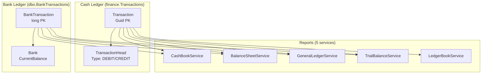

# 📊 FrostTrack Solution Analysis: Transactional Architecture & Balance Calculation

## Executive Summary

After a thorough 14-role cross-functional audit of the entire FrostTrack transactional architecture, I've identified **significant structural complexity and several critical correctness risks** in how money flows are tracked, balances are calculated, and financial reports are generated. The core issue is a **dual-ledger design** (cash `Transaction` + separate `BankTransaction`) with **inconsistent sign conventions**, **massive code duplication across 5+ report services**, and a **fragile opening-balance calculation that is copy-pasted everywhere**.

The good news: the domain model (Booking → Delivery → Charge) is sound. The problems are in the financial accounting layer sitting on top.

---

## Health Scorecard

| Pillar | Rating | Status | Key Finding |
| :--- | :---: | :---: | :--- |
| **Transaction Table Design** | C+ | 🔴 Complex | Dual-ledger (`Transaction` + `BankTransaction`) with no unified view |
| **Balance Calculation** | D+ | 🔴 Critical | Copy-pasted across 5 services, inconsistent sign semantics, silent bugs |
| **Booking Due / Accrual** | B- | 🟡 Fragile | Dynamic computation is correct but fragile; no materialized balance |
| **Recurring Charges** | B+ | 🟢 Solid | Clean append-only ledger, proper concurrency guard |
| **Report Services** | D | 🔴 Critical | 5 services with near-identical opening-balance logic, divergent bugs |
| **Code Duplication** | D | 🔴 Critical | ~400 lines of identical UTC/opening-balance code duplicated |
| **Performance** | C | 🟡 Risk | N+1 patterns in `GetBookingsWithDueAsync`, full-table scans for balances |

---

## 🔴 Critical Finding #1: The "NetAmount Sum" Balance Bug

### The Problem

All transactions store `NetAmount` as a **positive value** — the DEBIT/CREDIT direction is determined by `TransactionHead.Type`. But the opening-balance calculation sums `NetAmount` directly without applying direction:

```csharp
// CashBookService.cs:L56-65, GeneralLedgerService.cs:L53-62, 
// BalanceSheetService.cs:L64-74, TrialBalanceService.cs:L53-61
var previousCashAmount = await _transactionRepository.Query()
    .Include(t => t.TransactionHead)
    .Where(t => ...)
    .SumAsync(t => t.NetAmount, cancellationToken);  // ⚠️ ALWAYS POSITIVE!
```

> [!CAUTION]
> **This sums ALL transactions as positive**, regardless of whether they are income (CREDIT) or expenses (DEBIT). Expense transactions should subtract from the balance, but they ADD to it. This means the opening balance is **overstated** by 2× the total expense amount.

### Where It's Correct vs Wrong

| Service | Opening Balance Logic | Correct? |
|---|---|---|
| [CashBookService.cs](file:///d:/Personel/FrostTrack_Web/Application/Services/CashBookService.cs#L56-L65) | `SumAsync(t => t.NetAmount)` — no direction | ❌ **Bug** |
| [BalanceSheetService.cs](file:///d:/Personel/FrostTrack_Web/Application/Services/BalanceSheetService.cs#L64-L74) | `SumAsync(t => t.NetAmount)` — no direction | ❌ **Bug** |
| [GeneralLedgerService.cs](file:///d:/Personel/FrostTrack_Web/Application/Services/GeneralLedgerService.cs#L53-L62) | `SumAsync(t => t.NetAmount)` — no direction | ❌ **Bug** |
| [TrialBalanceService.cs](file:///d:/Personel/FrostTrack_Web/Application/Services/TrialBalanceService.cs#L53-L61) | `SumAsync(t => t.NetAmount)` — no direction | ❌ **Bug** |
| [LedgerBookService.cs](file:///d:/Personel/FrostTrack_Web/Application/Services/LedgerBookService.cs#L49-L57) | `SumAsync(t => t.NetAmount)` — no direction | ❌ **Bug** |
| [BalanceSheetService.cs](file:///d:/Personel/FrostTrack_Web/Application/Services/BalanceSheetService.cs#L116) | `Sum(t => ... ? t.NetAmount : -t.NetAmount)` — **with direction** | ✅ Correct |

The daily view correctly applies direction (CREDIT = positive, DEBIT = negative), but the **opening balance carried forward** doesn't apply it, so the entire report chain is corrupted.

---

## 🔴 Critical Finding #2: Dual-Ledger Complexity (Transaction + BankTransaction)

### Current Architecture



### Problems

1. **Two completely separate tables** with different PK types (`Guid` vs `long`), different schemas, different audit fields
2. **Bank deposits SUBTRACT from cash** in opening balance: `bt.TransactionType == Deposit ? -bt.Amount : bt.Amount` — This is because depositing cash to bank reduces cash-in-hand. But this sign convention is the **opposite** of `BankBookService` where deposits are positive
3. **No unified transaction view** — every report service manually merges both tables with different sign logic
4. **`Bank.CurrentBalance`** is maintained as a mutable field that's updated on each `BankTransactionService.AddAsync()`, but there's **no recalculation on delete/update** — deleting a bank transaction silently corrupts the balance
5. **`BankTransaction` has `IsActive`** while `Transaction` has `IsDeleted`/`IsArchived` — inconsistent soft-delete semantics

---

## 🔴 Critical Finding #3: Opening Balance Code Duplication

The **exact same** ~30-line opening-balance calculation block is copy-pasted across **5 services**:

| Service | Lines | Bank Included? | `!IsDeleted` filter? |
|---|---|---|---|
| [CashBookService](file:///d:/Personel/FrostTrack_Web/Application/Services/CashBookService.cs#L20-L75) | L20-75 | ✅ Yes | ✅ Yes |
| [BalanceSheetService](file:///d:/Personel/FrostTrack_Web/Application/Services/BalanceSheetService.cs#L28-L85) | L28-85 | ✅ Yes | ✅ Yes |
| [GeneralLedgerService](file:///d:/Personel/FrostTrack_Web/Application/Services/GeneralLedgerService.cs#L21-L72) | L21-72 | ✅ Yes | ✅ Yes, but missing `TenantId` filter |
| [TrialBalanceService](file:///d:/Personel/FrostTrack_Web/Application/Services/TrialBalanceService.cs#L23-L71) | L23-71 | ✅ Yes | ⚠️ Missing `!IsDeleted` on cash |
| [LedgerBookService](file:///d:/Personel/FrostTrack_Web/Application/Services/LedgerBookService.cs#L18-L59) | L18-59 | ❌ **No bank** | ✅ Yes |

> [!WARNING]
> Each copy has **slightly different filter conditions** — some check `TenantId`, some don't. Some check `!IsDeleted`, some don't. `LedgerBookService` doesn't include bank transactions at all. These divergences mean each report can show a **different opening balance** for the same date.

---

## 🟡 Finding #4: Inconsistent Debit/Credit Sign Convention

The codebase uses **two contradictory conventions** for what "Debit" and "Credit" mean:

| Context | CREDIT (TransactionHead.Type) means | DEBIT means |
|---|---|---|
| **TransactionHead** constants | Money IN / Income | Money OUT / Expense |
| **CashBook / GeneralLedger rendering** | CREDIT → **Debit column** (Money IN) | DEBIT → **Credit column** (Money OUT) |
| **Accounting standard** | Right side, liability/equity increase | Left side, asset increase |

The code comments say `// Money IN = Debit` which is **the opposite of standard double-entry accounting**. While internally consistent, this creates confusion and will cause bugs when integrating with any standard accounting system.

---

## 🟡 Finding #5: Booking Due Calculation Complexity

The [BookingDueCalculator](file:///d:/Personel/FrostTrack_Web/Application/Services/Common/BookingDueCalculator.cs) and [BillCollectionService.GetBookingTotalAmountAsync](file:///d:/Personel/FrostTrack_Web/Application/Services/BillCollectionService.cs#L98-L122) recalculate the booking's total due amount **on every request** by:

1. Loading all booking details
2. Loading all deliveries for the booking
3. Summing all delivery charges + labour charges
4. Computing recurring charges dynamically from booking date to now
5. Then subtracting all BILL_COLLECTION transactions

> [!IMPORTANT]
> The `GetBookingsWithDueAsync` method ([BillCollectionService.cs:L38-L61](file:///d:/Personel/FrostTrack_Web/Application/Services/BillCollectionService.cs#L38-L61)) loads **ALL bookings**, then loops through each one calling `GetBookingTotalAmountAsync` + `GetBookingPaidAmountAsync` in sequence — this is an **N+1 query pattern** that fires ~4 queries per booking.

---

## 🟡 Finding #6: Delivery Creates Transactions Without Atomicity

[ProductDeliveryService.CreateAsync](file:///d:/Personel/FrostTrack_Web/Application/Services/ProductDeliveryService.cs#L54-L285) performs these operations in sequence without a database transaction:

1. Creates `Delivery` entity
2. Creates `BookingCharge` ledger entries (one per delivery detail)
3. Creates `Transaction` for charge amount
4. Creates `BookingPayment` ledger entry
5. Creates second `Transaction` for labour charge
6. Updates `Delivery` with `TransactionId`

If step 4 fails, steps 1-3 are already committed — leaving **orphaned charge records** with no matching payment. Similarly, the transaction code generation uses sequential numbering that can produce **duplicate codes** under concurrent delivery creation.

---

## 🟡 Finding #7: Bank.CurrentBalance Race Condition

[BankTransactionService.AddAsync](file:///d:/Personel/FrostTrack_Web/Application/Services/BankTransactionService.cs#L33-L78) reads `bank.CurrentBalance`, modifies it in memory, and writes it back. Under concurrent requests, two deposits can read the same balance and each add their amount, resulting in one deposit being "lost". There's **no optimistic concurrency token** on `Bank.CurrentBalance`.

---

## 🚀 Proposed Redesign: Simplified Transactional Architecture

### Principle: **Single Source of Truth + Signed Amounts**

> [!IMPORTANT]
> The following proposed changes require your review and approval before implementation.

### Change 1: Store Signed `NetAmount` on Transaction

Instead of storing all amounts as positive and relying on `TransactionHead.Type` to determine direction at query time, **store the signed value directly**:

```csharp
// CREDIT (income/money-in) → positive NetAmount
// DEBIT (expense/money-out) → negative NetAmount
entity.NetAmount = transactionHead.Type == TransactionHeadTypes.CREDIT 
    ? Math.Abs(entity.Amount) - entity.DiscountAmount + entity.AdjustmentValue
    : -(Math.Abs(entity.Amount) - entity.DiscountAmount + entity.AdjustmentValue);
```

**Impact**: Every balance calculation becomes `SumAsync(t => t.NetAmount)` — no joins to `TransactionHead` needed. Opening balance is a single SUM. All 5 report services collapse into trivial queries.

### Change 2: Extract Shared `BalanceCalculator` Service

Create a single `IBalanceCalculator` service that all report services use:

```csharp
public interface IBalanceCalculator
{
    Task<OpeningBalanceResult> GetOpeningBalanceAsync(DateTime asOfDate, CancellationToken ct);
    Task<IReadOnlyList<TransactionSummary>> GetDayTransactionsAsync(DateTime date, CancellationToken ct);
}
```

This eliminates the 400+ lines of duplicated opening-balance code and ensures **all reports compute the same balance**.

### Change 3: Unify Bank Transactions into the Transaction Table

Add bank-related columns to `Transaction` rather than maintaining a separate `BankTransaction` table:

```csharp
// Add to Transaction entity:
public int? BankId { get; set; }
public Bank? Bank { get; set; }
public string? BankReference { get; set; }
public decimal? BankBalanceAfter { get; set; }
```

**Impact**: One table, one query, one sign convention. Bank deposits are just transactions with a `BankId` and a CREDIT head. Withdrawals are transactions with a DEBIT head. All report services work against one table.

### Change 4: Compute `Bank.CurrentBalance` from Transactions

Instead of mutating `Bank.CurrentBalance` on each transaction, compute it:

```csharp
public async Task<decimal> GetBankBalanceAsync(int bankId)
{
    return await _transactionRepository.Query()
        .Where(t => t.BankId == bankId && !t.IsDeleted)
        .SumAsync(t => t.NetAmount); // Already signed
}
```

### Change 5: Wrap Delivery+Transaction Creation in a DB Transaction

```csharp
using var dbTransaction = await _context.Database.BeginTransactionAsync();
try
{
    // 1. Create Delivery
    // 2. Create BookingCharges
    // 3. Create Transaction
    // 4. Create BookingPayment
    await dbTransaction.CommitAsync();
}
catch
{
    await dbTransaction.RollbackAsync();
    throw;
}
```

### Change 6: Materialize Customer Balance

Add a `CustomerBalance` computed view or denormalized field that tracks the running total for each customer-booking:

```sql
-- Materialized view or indexed view
SELECT BookingId, 
       SUM(CASE WHEN UsageFor = 'BILL_COLLECTION' THEN NetAmount ELSE 0 END) as PaidAmount,
       SUM(CASE WHEN UsageFor IN ('BOOKING','DELIVERY') THEN NetAmount ELSE 0 END) as ChargedAmount
FROM finance.Transactions
GROUP BY BookingId
```

This eliminates the N+1 loop in `GetBookingsWithDueAsync`.

---

## Open Questions

> [!IMPORTANT]
> **Q1: Migration Strategy** — Do you want to migrate the existing `BankTransaction` data into the unified `Transaction` table, or keep `BankTransaction` as a legacy table and only unify going forward?

> [!IMPORTANT]  
> **Q2: Sign Convention** — Are you comfortable switching to signed `NetAmount` (positive = money in, negative = money out)? This requires a data migration to negate all existing DEBIT transaction amounts.

> [!IMPORTANT]
> **Q3: Scope** — Do you want me to implement all 6 changes, or would you prefer to start with the most critical fixes first (Fix #1 balance bug + Fix #2 extract shared calculator)?

---

## Verification Plan

### Automated Tests
- Add unit tests for `BalanceCalculator` with known transaction sets
- Test signed `NetAmount` computation against manual calculations
- Verify opening balance consistency across all 5 report services
- Test concurrent bank transaction creation for race conditions

### Manual Verification
- Run existing reports before/after migration and compare outputs
- Verify booking due amounts match manual calculations
- Test delivery creation with transaction in dev environment
